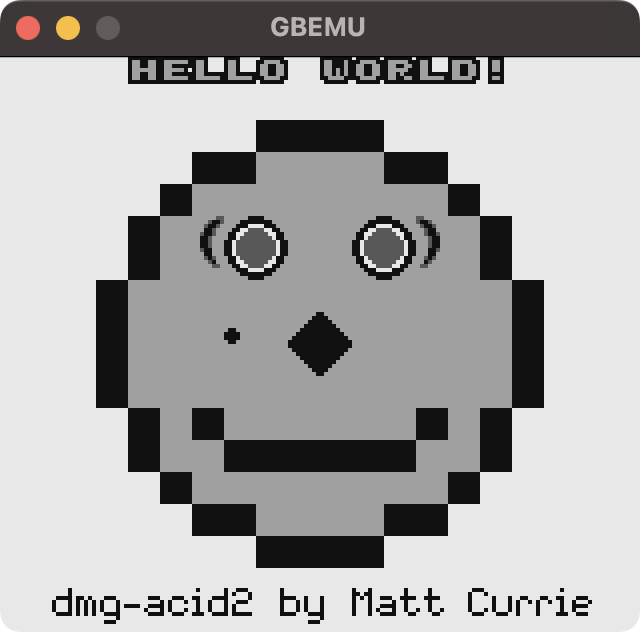

# gbemu

C++で書いたゲームボーイエミュレータです。

## 動作環境

* MacBook Air M1 2020でのみ動作確認しています
* 特にモニタの垂直同期信号が60Hzでない場合、表示が乱れるかもしれません

## 機能

* MBC1カートリッジのプレイ
   * 他の種類のカートリッジには対応していません
* セーブ
  * ROMのバイナリと同じディレクトリに*.savという名前で保存されます
* ブートROMの読み込み
  * ブートROM自体は付属していません
* グラフィック・オーディオのエミュレーション

## 動作の正確性

* [Blargg’s test roms](https://gbdev.gg8.se/files/roms/blargg-gb-tests/)のcpu_instrsとinstr_timingをパスしています。他は失敗します。
* [dmg-acid2](https://github.com/mattcurrie/dmg-acid2)を顔のホクロ以外パスしています（下記画像参照）。顔のホクロもパスできるのですが、GB/GBC両対応のゲームをプレイするときパスしない挙動の方が自然なのであえて残しています。



## 使用方法

```
# `--bootrom <path_to_bootrom>`は省略可能です
./gbemu --rom <path_to_rom> --bootrom <path_to_bootrom>
```

## ビルド

Mac環境でしか試してません。

### ビルドに必要なもの

* C++17に対応したGCCまたはClang
* CMake
* CMakeが設定を生成できるビルドツール（MakeとかNinjaとか）
* SDL2

### ビルドのコマンド

```
clone https://github.com/sitorasu/gbemu.git
mkdir build
cd build
cmake .. -DCMAKE_BUILD_TYPE=Release
cmake --build .
```
